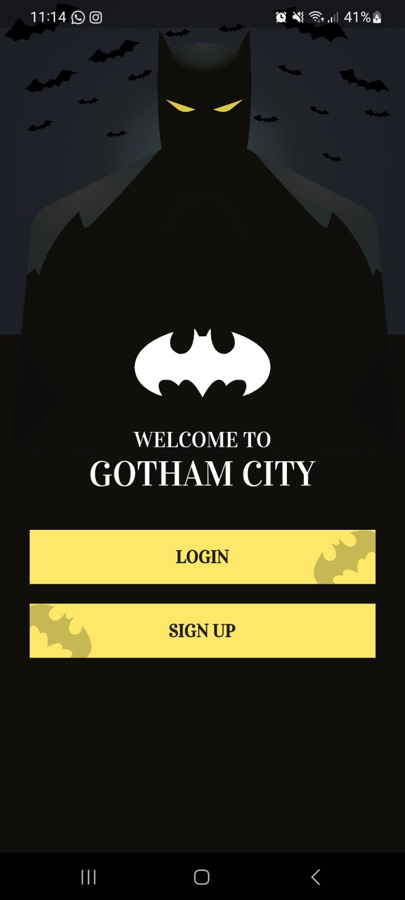
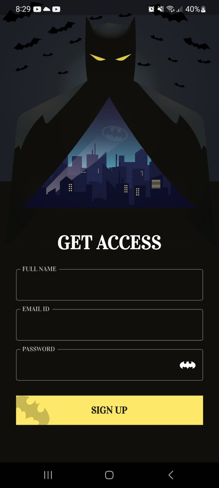

# Custom Login App With Animation

A custom login app with animation built using Flutter. 

## Demo

https://user-images.githubusercontent.com/104875404/222737081-984b6d80-6fa5-4104-80cc-431313e504af.mp4

## Features

- Custom login form with animation
- Use of AnimationController, Twee, and CurveAnimation for animation effects

## Getting Started

1. Clone the repository

2. Open the project in your preferred IDE.

3. Run the app on an emulator or physical device.

## Contributing

Contributions are always welcome! If you have any ideas or suggestions, please create a GitHub issue or submit a pull request.
